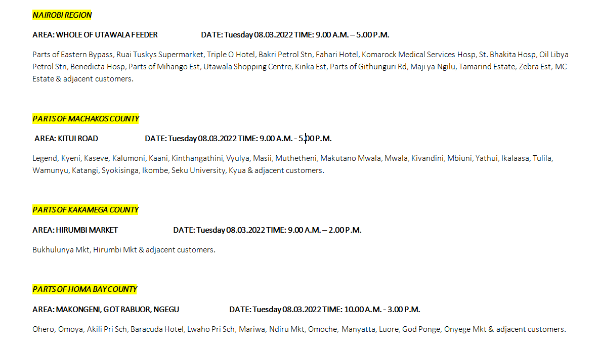

# DoomAlerts
[](https://github.com/ro6ley/DoomAlerts/actions/workflows/test.yml)

If KPLC is scheduled to do full-day maintenance in my area, let me know in advance!

## Modus Operandi

It should work much like the NASA emails when the ISS is going to be in your area. Sign up and configure?

* Crob job to fetch tweets periodically - everyday at 6? Every 4 hours? parse as they are posted (stream)?

* Filter for shutdown tweets - using keywords populated from previous tweet content (wordcloud of some sorts) ? filter by tweets containing images to narrow down further?

* Extract the text from images using OCR - using Leptess

* Store watchlist of locations in DB - names? GPS coordinates in future for Google Maps link? breakdown by regions? zones?

* Store user-customized watch list with the associated user?

* For each user, compare areas on latest tweet vs the user's watchlist

* If a match is found, format and send notification, if possible include original tweet

* Mode of delivery:
  - SMS
  - Twitter DM
  - Email
  - Mention on tweet?

### Samples

Input sample image: 

OCR'd text:
```
AREA: WHOLE OF UTAWALAFEEDER, DATE: Tuesday 08.03.2022 TIME: 9.00 A.M.—5.00P.M.

Parts of Eastern Bypass, Ruai Tuskys Supermarket, Triple O Hotel, Bakri Petrol Stn, Fahari Hotel, Komarock Medical Services Hosp, St. Bhakita Hosp, Oil Libya
Petrol Stn, Benedicta Hosp, Parts of Mihango Est, Utawala Shopping Centre, Kinka Est, Parts of Githunguri Rd, Maji ya Ngilu, Tamarind Estate, Zebra Est, MC
Estate & adjacent customers.

AREA: KITUI ROAD DATE: Tuesday 08.03.2022 TIME: 9.00 A.M.- 5D0P.M.

Legend, Kyeni, Kaseve, Kalumoni, Kaani, Kinthangathini, Vyulya, Masii, Muthetheni, Makutano Mwela, Mwala, Kivandini, Mbiuni, Yathui, kalaase, Tulila,
Wamunyu, Katangi, Syokisinga, Ikombe, Seku University, Kyua & adjacent customers.

AREA: HIRUMBI MARKET. DATE: Tuesday 08.03.2022 TIME: 9.00 A.M.—2.00P.M.

Bukhulunya Mkt, Hirumbi Mkt & adjacent customers.

AREA: MAKONGENI, GOT RABUOR, NGEGU DATE: Tuesday 08.03.2022 TIME: 10.00 A.M. - 3.00 P.M.

Ohero, Omoya, Akili Pri Sch, Baracuda Hotel, Lwaho Pri Sch, Mariwa, Ndiru Mkt, Omoche, Manyatta, Luore, God Ponge, Onyege Mkt & adjacent customers.
```


## Getting Started

These instructions will get you a copy of the project up and running on your local machine for development and testing purposes. See deployment for notes on how to deploy the project on a live system.

### Building Blocks

- Rust
- Tesseract
- [Leptess v0.13.2](https://github.com/houqp/leptess)

### Environment Variables

The following environment variables are needed to be set when running the project or Docker image:

* `API_KEY` - as provided by Twitter on the developer portal, configuring a Twitter App as a Social App will provide it
* `API_SECRET_KEY` - as provided by Twitter on the developer portal, configuring a Twitter App as a Social App will provide it
* `LOCATIONS` - comma separated list of areas to be on the lookout for

### Local Development

* clone the repo:
  ```bash
  $ git clone https://github.com/ro6ley/DoomAlerts.git
  $ cd DoomAlerts
  ```

* start the application:
  ```bash
  $ cargo run
  ```

* run tests:
  ```bash
  $ cargo test
  ```

### Running in Docker

* WIP

### Production Deployment

* WIP

## Authors

* **[Robley Gori](https://github.com/ro6ley)** - *Initial work*

See also the list of [contributors](https://github.com/ro6ley/DoomAlerts/contributors) who participated in this project.
